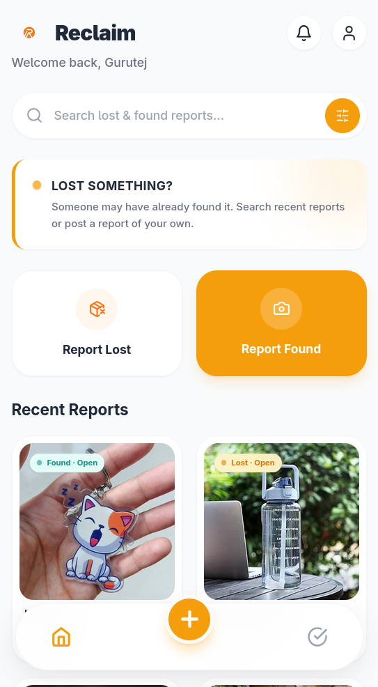
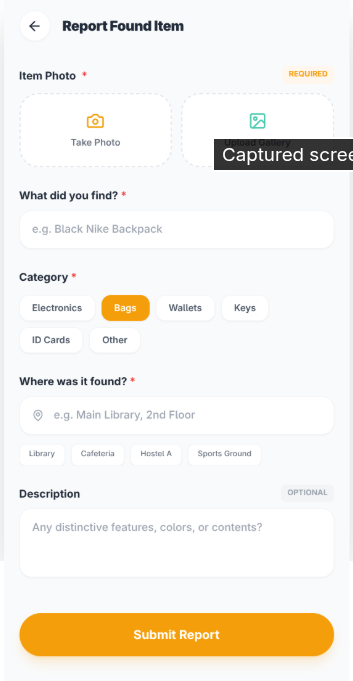
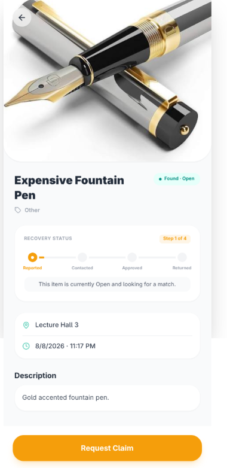
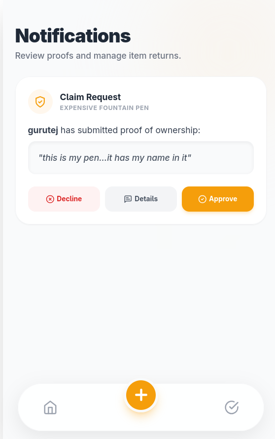
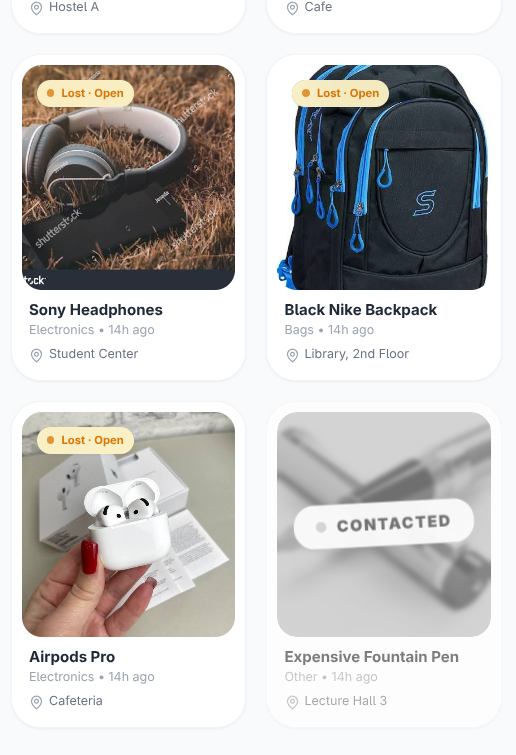
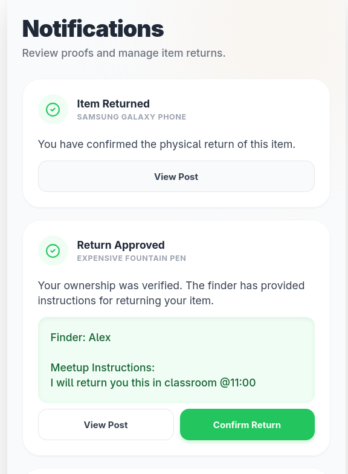
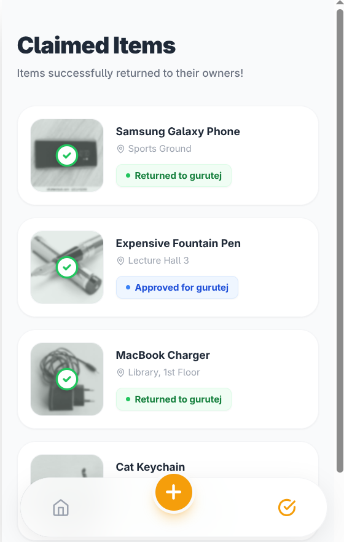

# Reclaim

> **Find it. Verify it. Reclaim it.**

Reclaim is a campus Lost & Found application built around one simple problem: when a student loses something, finding it again often means checking different WhatsApp groups, asking people around campus, or hoping someone has posted about it somewhere.

I wanted to build something more focused than that.

Reclaim is not another social platform, marketplace, or messaging application. It is designed around one purpose: **helping a lost item get back to its owner.**

---

## The Problem I Wanted to Solve

A basic Lost & Found board can let someone create a report and view it later. But that leaves an important problem unsolved:

**How do we know that the person claiming an item actually owns it?**

That became the main idea behind Reclaim.

Instead of treating a claim as enough proof, Reclaim introduces a simple verification and recovery flow. A person claiming an item has to provide specific details they know about it. The person who found the item can then review those details and decide what happens next.

This turns the application from a simple CRUD board into a small recovery workflow.

---

## How Reclaim Works

The core flow is:

```text
Report
   ↓
Discover
   ↓
Claim
   ↓
Verify
   ↓
Arrange Return
   ↓
Confirm Return
```

### 1. Report

A student can report either a **lost** or **found** item.

A report can include:

- Item title
- Description
- Category
- Location
- Date
- Photo

The intention is to make the report useful enough for someone else to recognize the item without making the reporting process unnecessarily complicated.

### 2. Discover

Reports can be browsed from the main feed.

Search and filters help reduce the need to manually go through every report.

The interface also separates active reports from items that are already being handled. Once a report enters the recovery process, it becomes visually quieter instead of continuing to compete with open reports.

### 3. Claim

A person who believes an item belongs to them can request it.

They cannot simply say:

> "This is mine."

They have to provide specific information about the item that can be checked against the actual object.

For a found item, the finder can also describe what they found, while the potential owner can request additional proof such as a photo.

### 4. Verify

The finder reviews the information provided by the claimant.

There are three possible decisions:

- **Approve** — the details are convincing enough.
- **Ask for more details** — the information is not enough yet.
- **Decline** — the information does not match.

If more information is requested, the claimant can provide it and verification can continue.

If the claim is declined, the report becomes available in the open section again.

### 5. Arrange the Return

Once ownership has been verified, the application does not immediately assume that the item has physically changed hands.

The person returning the item provides:

- Their name
- Where the item will be returned

This keeps the return arrangement inside the recovery flow without introducing a general chat system.

### 6. Confirm the Return

Verification and physical return are two different things.

An item is not considered fully returned just because ownership was approved.

After the physical handover, the return can be confirmed and the item moves into the returned/claimed history.

This distinction was important to the design because:

> **Verified ownership does not necessarily mean the item has already been returned.**

---

## Why There Is No Chat

One deliberate decision was **not to build another WhatsApp inside the application**.

A general chat system would add complexity without necessarily improving the core problem.

Instead, Reclaim uses structured notifications for the interactions that actually matter:

- A claim was requested
- More information is required
- A claim was approved
- A claim was declined
- Return details were provided
- The item was returned

This keeps communication connected to the item and its recovery status.

The goal is not to create another place for people to socialize. The goal is to help two people coordinate the return of one item.

---

## Recovery Status

The status of an item is part of the experience rather than just a database field.

Open reports remain prominent because they still need attention.

Reports that are being handled are moved lower in the feed and shown with a muted appearance and a **Contacted** state.

The overall recovery lifecycle is:

```text
Open
  ↓
Claim Request
  ↓
Contacted
  ↓
Verification
  ├── Ask for more details → Verification continues
  ├── Decline             → Open
  └── Approve
          ↓
       Claimed
          ↓
    Return arranged
          ↓
       Returned
```

This makes the state of an item understandable without requiring the user to inspect every detail.

---

## Identity and Scope

The project uses a lightweight name-based login system.

A user enters their name and can then view their own reports and contribution.

This was a deliberate scope decision for the assessment. A full authentication system was not required, so I kept identity simple rather than spending the limited development time building account infrastructure that was not central to the Lost & Found experience.

The current version should therefore be understood as an assessment prototype rather than a production-ready identity system.

---

## Ownership and Reports

A user can manage the reports they created.

Only the person who created a report is given the option to delete it through the application, and deletion requires confirmation.

Users can also see their reports and their contribution to recovered items.

The contribution view focuses on helping return belongings rather than turning the profile into a social profile.

---

## Design Decisions

The visual design was intentionally kept away from the usual patterns of social apps and marketplaces.

I wanted the interface to feel:

- Clear
- Calm
- Practical
- Easy to scan
- Focused on the item rather than the user

The important information is centered around:

**What is the item?**

**Where was it lost or found?**

**What is its current status?**

**What can I do next?**

The interface uses status, spacing, hierarchy, and muted states to communicate the recovery process rather than filling the screen with unnecessary controls.

---

## Screenshots

The screenshots should show the product as a complete experience rather than simply showing every screen.

### 1. Home / Discover



> **Home — Browse, search, and filter campus Lost & Found reports.**

### 2. Report an Item



> **Reporting — A focused form for creating a lost or found report.**

### 3. Item Details



> **Item details — The information needed to identify and act on a report.**

### 4. Verification



> **Verification — Claims are reviewed using item-specific information instead of a simple ownership button.**

This is one of the most important screenshots in the README.

### 5. Contacted State



> **Contacted — Reports currently being handled are visually separated from open reports.**

### 6. Return Confirmation



> **Return — Ownership verification and physical return are treated as separate steps.**

### 7. Claimed / Recovered History



> **Claimed — A record of items that have completed the recovery process.**

---

## Technology

### Frontend

- React 18
- Vite
- JavaScript
- Tailwind CSS
- React Router
- Lucide React

### Backend

- Supabase
  - PostgreSQL
  - Storage
  - Row Level Security

The application uses Supabase for report data and image storage.

The current database structure is documented in:

```text
supabase/schema.sql
```

---

## Project Structure

```text
reclaim/
├── docs/
│   └── wireframes.md
├── public/
├── src/
│   ├── components/
│   ├── data/
│   ├── lib/
│   └── pages/
├── supabase/
│   └── schema.sql
├── .env.example
├── index.html
├── LICENSE
├── package.json
├── README.md
├── tailwind.config.js
└── vite.config.js
```

---

## Getting Started

### Clone

```bash
git clone https://github.com/<username>/reclaim.git
cd reclaim
```

### Install dependencies

```bash
npm install
```

### Configure environment variables

```bash
cp .env.example .env
```

Then add the required Supabase values:

```env
VITE_SUPABASE_URL=
VITE_SUPABASE_ANON_KEY=
```

### Database

The expected database structure is documented in:

```text
supabase/schema.sql
```

### Run locally

```bash
npm run dev
```

---

## Current Scope

Reclaim was built within a limited development window, so the project focuses on the parts that directly affect the Lost & Found recovery experience.

The current version provides:

- Lost and found reporting
- Search and filtering
- Item details
- Image uploads
- Claim requests
- Ownership verification
- Ask-for-more-details flow
- Claim approval and decline
- Structured notifications
- Return arrangement
- Return confirmation
- Personal reports
- Contribution history
- Claimed/recovered history

Some production-level features, such as full account authentication and stronger identity/authorization infrastructure, are outside the current assessment scope.

---

## Future Improvements

If Reclaim were taken beyond the current prototype, the next improvements would focus on strengthening the system rather than adding unnecessary social features.

Possible directions include:

- Full authentication and account management
- Stronger server-side authorization
- Smarter lost/found matching
- QR codes for personal belongings
- Better image processing and categorization
- More advanced notification delivery
- Campus-specific integrations

---

## Motivation

The idea behind Reclaim is fairly simple.

When someone loses something, the problem is not really:

> "Where can I create a post?"

The real problem is:

> **"How do I know the item I found is actually theirs, and how do we get it back to them?"**

That is why the project is built around the recovery process rather than just the listing itself.

**Report → Discover → Verify → Arrange → Return.**

That is what Reclaim is meant to make easier.

---

## License

This project is licensed under the MIT License.